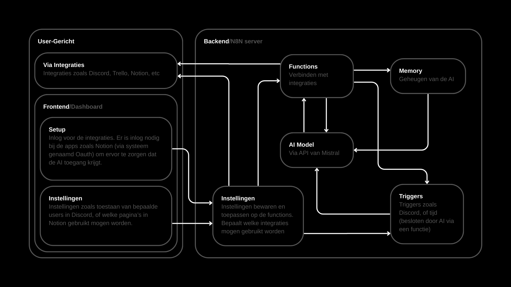

1. Discord (DC) messages
toegestane servers/channels
wie mag er mee praten
geen @everyone (wie mag er getagd worden via @)
cooldown tussen berichten

2. Trello kaarten
Welke borden?
Welke lijsten?
Mag kaartjes verwijderen? (ja/nee)
Mag kaartjes aanpassen? (ja/nee)

3. Internet zoeken
zoekprovider (Google/Bing)
blacklist sites
Safety
geen verdachte downloads

4. Afbeeldingen genereren
Geen instellingen

5. Eigen filesysteem
Geen extra instellingen, het is dan ook een persoonlijk systeem van de ai dus kan niet echt schade op gebruiker verichten

6. GitHub info lezen
Welke repositories zien? (lijst)
Welke repo's branch/pr mogen maken? (lijst)

7. Summarize Session Hostory
Geen instellingen

8. Gitlab info lezen
Zelfde als github

9. Slack
Weet niet zeker hoe Slack werkt, meot nog uitgevogled worden

10. Linear
Weet niet zeker hoe Linear werkt, meot nog uitgevogled worden

11. Asana
Weet niet zeker hoe Asana werkt, meot nog uitgevogled worden

12. Notion
Welk team?
Welke paginas gezien mogen?
Toevoegen toegstaaan? (Ja/nee)
Verwijderen mogelijk? (Ja/nee)

